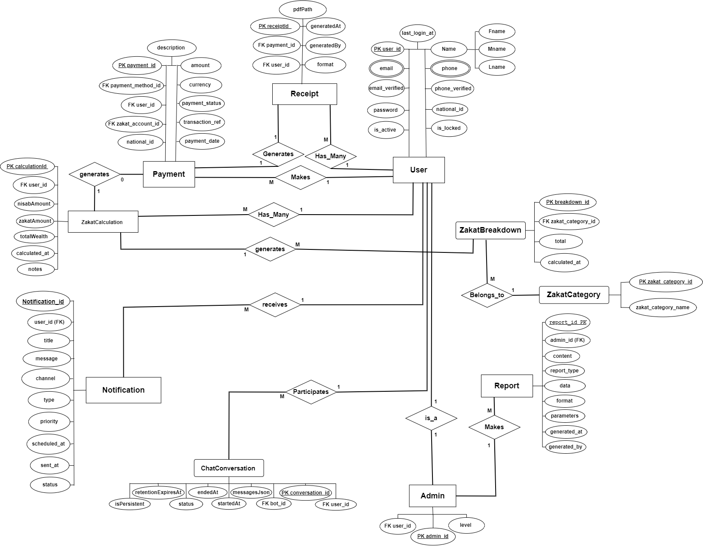
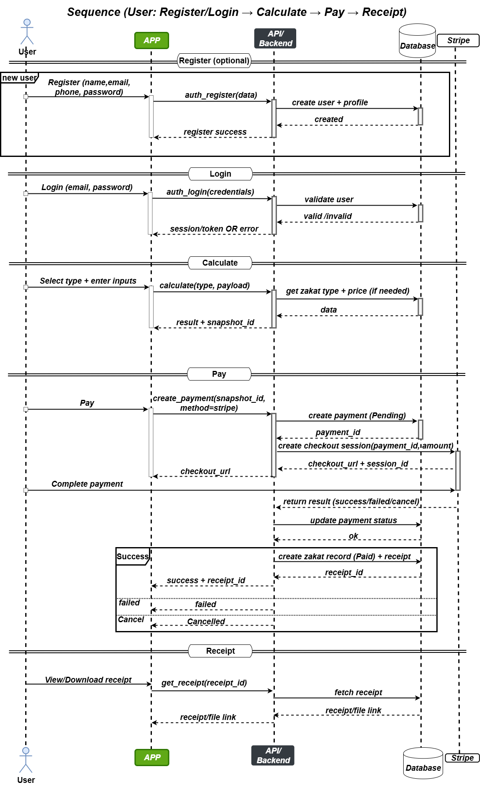
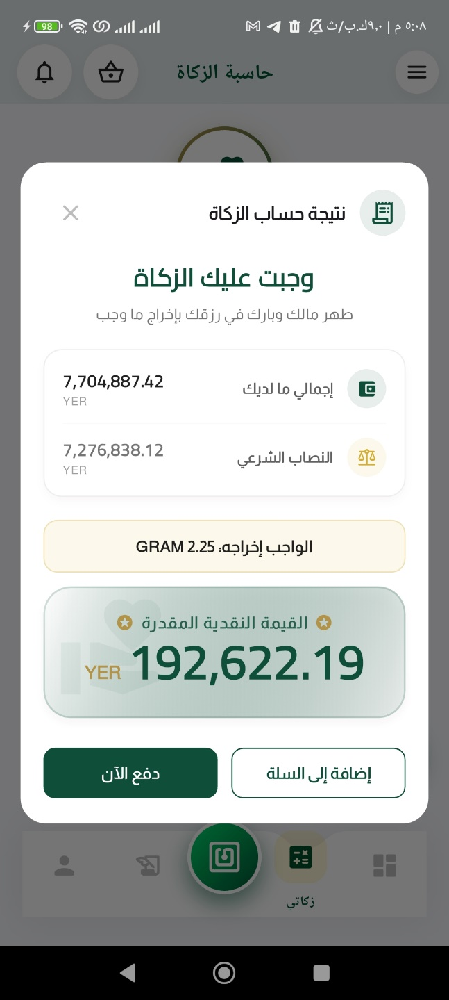
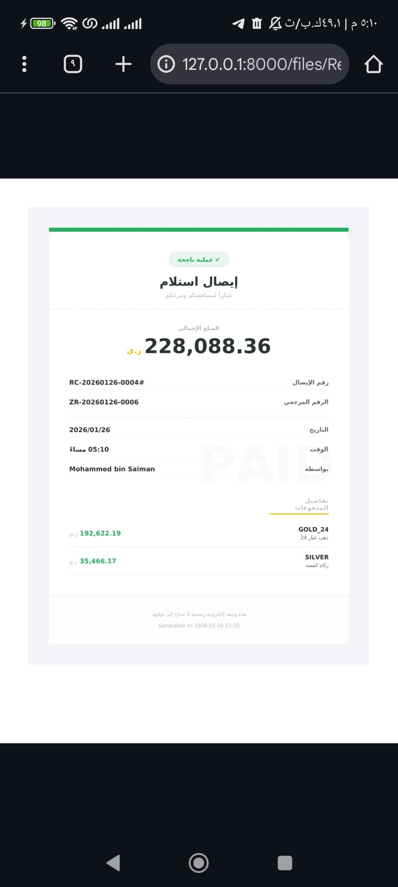
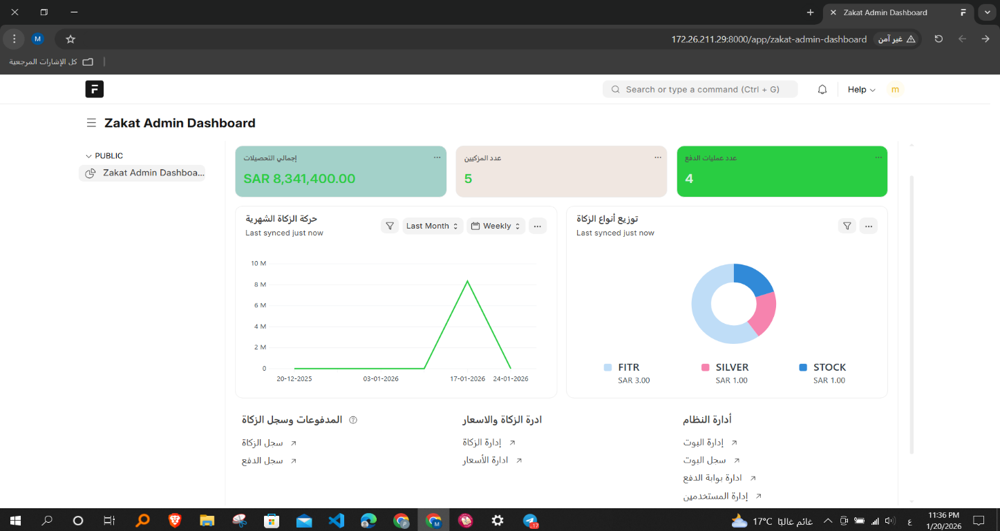
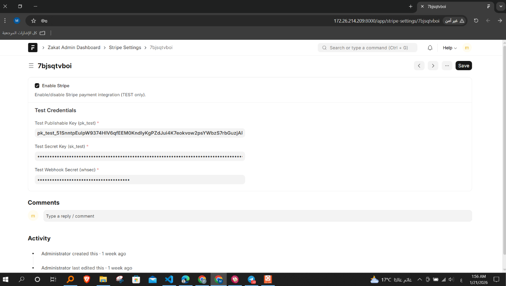
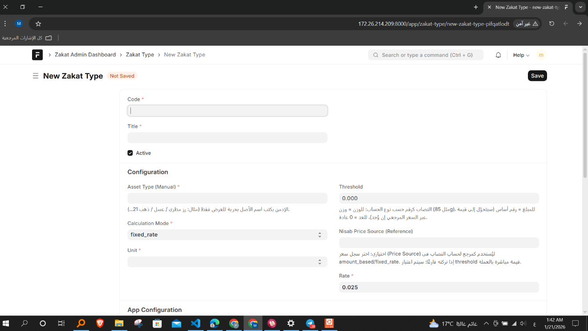
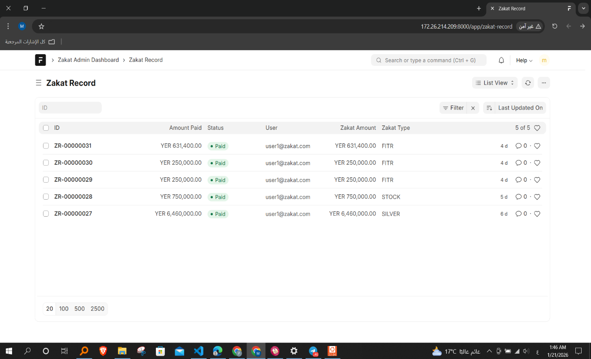

# Zakat | General Authority of Zakat - Enterprise System

> **⚠️ Commercial Enterprise Product & Intellectual Property**
> 
> Please note that this repository outlines the core architecture and UI/UX flows of a **proprietary, closed-source mobile application and administrative backend**. 
> 
> The structural blueprints and visual assets are made public exclusively as an **Architectural Proof of Work** to demonstrate system integrity, Domain-Driven Design principles, and API orchestration. The source code, AI interaction models, and proprietary business logic remain strictly confidential and are not authorized for replication.

---

## System Overview

Zakat3 is a highly structured, scalable mobile application and centralized backend administration system explicitly designed and developed for the **General Authority of Zakat**. The system automates complex financial calculations, facilitates secure digital payments, and provides AI-driven assistance, decoupling the frontend client (Flutter) from the heavy business logic managed by a Frappe-based backend.

---

## 1. Architectural Blueprint (Domain-Driven Design)

The backend architecture is strictly compartmentalized into isolated domains to ensure separation of concerns and horizontal scalability.

*   **Zakat Core Domain:** Manages `ZakatType`, dynamically configurable `Nisab` logic, and the immutable `CalculationSnapshot`.
*   **Cart & Payments Domain:** Handles the aggregation of `CartItem` elements and orchestrates secure transactions through `Payment` and `PaymentTransaction` entities.
*   **Pricing & Supporting Services:** Isolates external dependencies, including live market `PriceSource` feeds and `ChatbotLog` data pipelines.

## 2. Data Modeling & Relational Integrity

The database schema is highly normalized, utilizing strict foreign key constraints and transactional integrity.

*   **Financial Auditing:** Every `Payment` is irrevocably tied to a specific `ZakatCalculation` and triggers the generation of an immutable `Receipt`. 
*   **Decentralized Zakat Breakdown:** Calculations are logically divided into a `ZakatBreakdown` entity linked to a specific `ZakatCategory`, allowing for precise, granular reporting.
*   **AI Context Retention:** The `ChatConversation` entity logs bot IDs, user IDs, and messages in a JSON format (`messagesJson`) to retain user context and facilitate system auditing.

## 3. Core System Workflows

The system enforces strict operational workflows designed to maximize security and UX efficiency.

### User Financial Pipeline
*   **Stateless Calculation:** Unauthenticated guests can perform calculations, but system validation requires active authentication (Login/Registration) to proceed to checkout.
*   **Direct Payment Bypass:** Users possess the flexibility to bypass the automated calculation engine and execute direct payments for standard donations.
*   **Secure Checkout Orchestration:** The frontend initiates a checkout sequence, retrieves a transaction payload, securely processes the payment via Stripe, and awaits backend validation before generating the final PDF receipt.

### Administrative Orchestration
*   **Centralized Control:** Administrators access an independent dashboard to review Zakat records, audit payment transactions, and update dynamic Nisab values.
*   **Dynamic Configurations:** The admin panel directly exposes controllers to enable/disable specific Zakat types, manage AI chatbot webhooks, and configure the payment gateway without requiring application deployments.
*   **Data Exportation:** The system supports generating and exporting comprehensive financial reports detailing Zakat metrics and payment histories.

---

## 4. Technical Stack

*   **Mobile Frontend:** Flutter (Dart), State Management, Secure Local Storage.
*   **Backend Framework:** Frappe (Python), providing rapid RESTful API generation and robust RBAC (Role-Based Access Control).
*   **Database:** MariaDB/MySQL.
*   **AI & Automation:** n8n for Webhook orchestration, custom LLM integration for the AI Chatbot.
*   **Payment Infrastructure:** Stripe API with strict Server-to-Server webhook validation.
*   **Document Generation:** Automated Server-Side PDF rendering for official receipts.

---

## 5. System Interfaces & Architecture (Showcase)

*(The visual documentation below demonstrates the structural integrity, UI logic, and backend control environments).*

### Architecture & System Design
| Entity-Relationship Diagram | System Sequence Flows |
| :---: | :---: |
|  |  |

### Client Interfaces (Flutter)
| Home Dashboard & Live API Feeds | Calculation Engine & Logic | AI Chatbot Assistance | Official Digital Receipts |
| :---: | :---: | :---: | :---: |
|  |  |  |  |

### Administrative Control (Frappe Backend)
| Enterprise Dashboard & Telemetry | Stripe Gateway Configuration | Dynamic Schema & Pricing | Strict Financial Auditing |
| :---: | :---: | :---: | :---: |
|  |  |  |  |